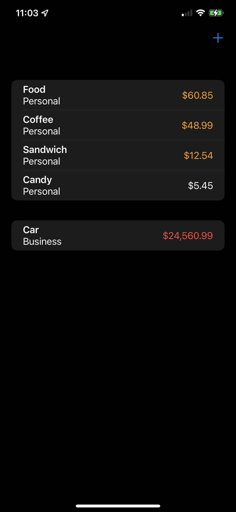
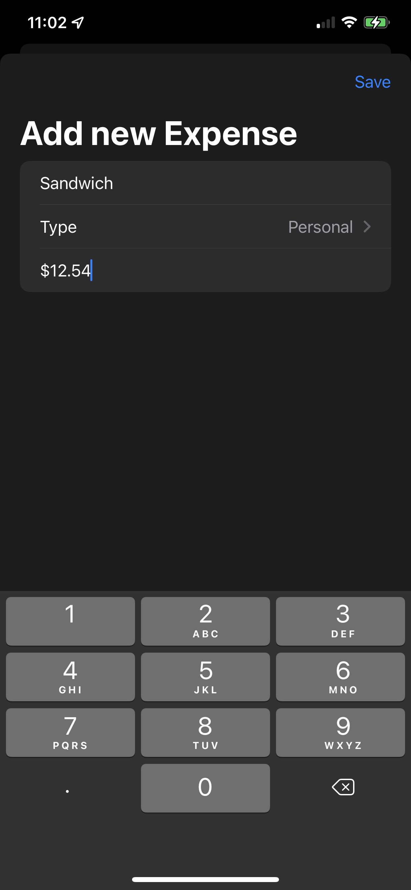

# iExpense
Expense tracking app. Project 7 day 36,37,38 of 100 days of swiftUI

A simple app for tracking expenses, storing the data in userdefaults in a simple json file. And some accessibility corrections to make it work with the iOS reader

 

## TODO
1. I want to take this and make it a bit more simple to track total amount of fun money left from a monthly allowance and put it up. Basically another app entierly.
